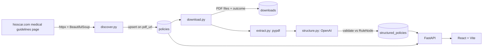

# WALKTHROUGH

A follow-along explanation of the codebase, written phase by phase.

## Architecture (target)

## Phase 0 — Scaffolding

**Built:**
- `docker-compose.yml` — Postgres 16 + pgweb. pgweb connects via the compose network using service host `postgres`; the host app uses `localhost`.
- `pyproject.toml` — uv-managed; `backend` is an installed package (hatchling) so modules run as `backend.pipeline.*`.
- `backend/app/config.py` — `Settings` (pydantic-settings) reads `.env`. Holds DB URL, OpenAI config, source page URL, data dirs.
- `backend/app/db.py` — async engine + sessionmaker + `Base`; `init_db()` runs `create_all`.
- `backend/app/models.py` — `Policy`, `Download`, `StructuredPolicy`. `pdf_url` UNIQUE for idempotent discovery; `structured_policies.policy_id` UNIQUE for idempotent structuring; JSONB for `structured_json`/`llm_metadata`.
- `backend/app/schemas.py` — recursive `RuleNode` + `StructuredPolicySchema`. A `model_validator` enforces the leaf/branch invariant: children ⇔ operator. `extra="forbid"` rejects stray LLM keys.

**Decisions:**
- `gpt-4o-mini` default — cheap, supports structured outputs; overridable via `OPENAI_MODEL`.
- Real key lives only in `.env` (gitignored); `.env.example` ships placeholders.

_(Later phases appended below as we build.)_
