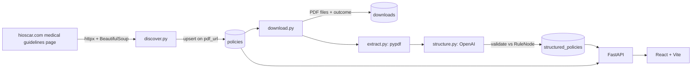

# WALKTHROUGH

A follow-along explanation of the codebase, written phase by phase.

## Architecture (target)

## Phase 0 — Scaffolding

**Built:**
- `docker-compose.yml` — Postgres 16 + pgweb. pgweb connects via the compose network using service host `postgres`; the host app uses `localhost`.
- `pyproject.toml` — uv-managed; `backend` is an installed package (hatchling) so modules run as `backend.pipeline.*`.
- `backend/app/config.py` — `Settings` (pydantic-settings) reads `.env`. Holds DB URL, OpenAI config, source page URL, data dirs.
- `backend/app/db.py` — async engine + sessionmaker + `Base`; `init_db()` runs `create_all`.
- `backend/app/models.py` — `Policy`, `Download`, `StructuredPolicy`. `pdf_url` UNIQUE for idempotent discovery; `structured_policies.policy_id` UNIQUE for idempotent structuring; JSONB for `structured_json`/`llm_metadata`.
- `backend/app/schemas.py` — recursive `RuleNode` + `StructuredPolicySchema`. A `model_validator` enforces the leaf/branch invariant: children ⇔ operator. `extra="forbid"` rejects stray LLM keys.

**Decisions:**
- `gpt-4o-mini` default — cheap, supports structured outputs; overridable via `OPENAI_MODEL`.
- Real key lives only in `.env` (gitignored); `.env.example` ships placeholders.

## Phase 1 — PDF discovery (console only)

**Built:**
- `backend/pipeline/scraper.py` — `PoliteClient`: bounded concurrency (semaphore), a min-interval throttle (serialized gate), and retry with exponential backoff on transport errors / 5xx. Reused by download later.
- `backend/pipeline/discover.py`:
  - `parse_listing()` — parses the listing page's `__NEXT_DATA__` and walks **every** module + nested list, collecting items whose link `text == "PDF"` and whose `href` is internal. Skips external `"LINK"` items and the *Upcoming Policy Changes* / *Adopted Guidelines* sections (`EXCLUDED_SECTIONS`). Dedups by href.
  - `extract_pdf_url()` — fetches a policy page and finds its document asset in `__NEXT_DATA__` (a Contentful asset dict = `url` + `fileName`). Prefers a `.pdf` URL; falls back to the lone non-image asset (some docs are extensionless but serve `application/pdf`).
  - `discover()` — listing → resolve each policy page's PDF concurrently; failures recorded per-item, never crash the run.

**Why this guarantees completeness (Q/A):**
- The full guideline list is **embedded in `__NEXT_DATA__`** server-side — no pagination, no infinite scroll, no client API call. Parsing the JSON (not the rendered DOM) means we can't miss items that lazy-load.
- We walk the entire module tree recursively, so nested/expandable lists are covered.
- Detecting misses: every listing item must resolve to exactly one PDF; unresolved items are printed in a `FAILED TO RESOLVE` block. Uniqueness is asserted (unique page URLs == unique PDF URLs == item count).

**Result:** 159 PDF links in the *Medical Guidelines* section (97 `/medical` CG + 62 `/pharmacy` PG), all resolved, all unique. (Counts drift slightly run-to-run — the source page is live.) Multiple versions of a guideline (e.g. CG008 v11 + v12) are each a distinct PDF and kept.

**Decision — scope of "PDF links":** we capture every internal PDF-typed link **within the Medical Guidelines section**. This includes pharmacy (`PG`) docs that Oscar lists under that header. We exclude the *Upcoming Policy Changes* (drafts not yet in effect) and *Adopted Guidelines* (third-party) sections, plus external `"LINK"` items.

## Phase 2 — Persist discovery

**Built:**
- `discover.persist()` — bulk Postgres upsert via `INSERT ... ON CONFLICT (pdf_url) DO UPDATE`. `pdf_url` is the natural key (UNIQUE in `models.Policy`). On conflict it refreshes `title` + `source_page_url`; `discovered_at` (server default) is set once on first insert and untouched on update.
- The entrypoint now persists by default and prints the resulting row count. `--no-persist` keeps the Phase 1 console-only behavior.

**Idempotency (Q/A):** the upsert is keyed on `pdf_url`, so reruns update-in-place rather than insert. Verified: two consecutive runs both leave the table at 159 rows; `count(*) == count(DISTINCT pdf_url)`.

_(Later phases appended below as we build.)_
