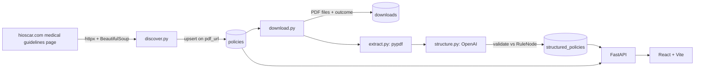
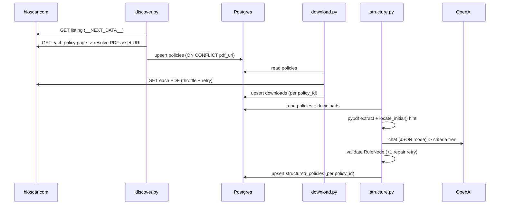

# WALKTHROUGH

A follow-along explanation of the codebase, written phase by phase.

## Architecture (target)



## Phase 0 — Scaffolding

**Built:**
- `docker-compose.yml` — Postgres 16 + pgweb. pgweb connects via the compose network using service host `postgres`; the host app uses `localhost`.
- `pyproject.toml` — uv-managed; `backend` is an installed package (hatchling) so modules run as `backend.pipeline.*`.
- `backend/app/config.py` — `Settings` (pydantic-settings) reads `.env`. Holds DB URL, OpenAI config, source page URL, data dirs.
- `backend/app/db.py` — async engine + sessionmaker + `Base`; `init_db()` runs `create_all`.
- `backend/app/models.py` — `Policy`, `Download`, `StructuredPolicy`. `pdf_url` UNIQUE for idempotent discovery; `structured_policies.policy_id` UNIQUE for idempotent structuring; JSONB for `structured_json`/`llm_metadata`.
- `backend/app/schemas.py` — recursive `RuleNode` + `StructuredPolicySchema`. A `model_validator` enforces the leaf/branch invariant: children ⇔ operator. `extra="forbid"` rejects stray LLM keys.

**Decisions:**
- `gpt-4o-mini` default — cheap, supports structured outputs; overridable via `OPENAI_MODEL`.
- Real key lives only in `.env` (gitignored); `.env.example` ships placeholders.

## Phase 1 — PDF discovery (console only)

**Built:**
- `backend/pipeline/scraper.py` — `PoliteClient`: bounded concurrency (semaphore), a min-interval throttle (serialized gate), and retry with exponential backoff on transport errors / 5xx. Reused by download later.
- `backend/pipeline/discover.py`:
  - `parse_listing()` — parses the listing page's `__NEXT_DATA__` and walks **every** module + nested list, collecting items whose link `text == "PDF"` and whose `href` is internal. Skips external `"LINK"` items and the *Upcoming Policy Changes* / *Adopted Guidelines* sections (`EXCLUDED_SECTIONS`). Dedups by href.
  - `extract_pdf_url()` — fetches a policy page and finds its document asset in `__NEXT_DATA__` (a Contentful asset dict = `url` + `fileName`). Prefers a `.pdf` URL; falls back to the lone non-image asset (some docs are extensionless but serve `application/pdf`).
  - `discover()` — listing → resolve each policy page's PDF concurrently; failures recorded per-item, never crash the run.

**Why this guarantees completeness (Q/A):**
- The full guideline list is **embedded in `__NEXT_DATA__`** server-side — no pagination, no infinite scroll, no client API call. Parsing the JSON (not the rendered DOM) means we can't miss items that lazy-load.
- We walk the entire module tree recursively, so nested/expandable lists are covered.
- Detecting misses: every listing item must resolve to exactly one PDF; unresolved items are printed in a `FAILED TO RESOLVE` block. Uniqueness is asserted (unique page URLs == unique PDF URLs == item count).

**Result:** 159 PDF links in the *Medical Guidelines* section (97 `/medical` CG + 62 `/pharmacy` PG), all resolved, all unique. (Counts drift slightly run-to-run — the source page is live.) Multiple versions of a guideline (e.g. CG008 v11 + v12) are each a distinct PDF and kept.

**Decision — scope of "PDF links":** we capture every internal PDF-typed link **within the Medical Guidelines section**. This includes pharmacy (`PG`) docs that Oscar lists under that header. We exclude the *Upcoming Policy Changes* (drafts not yet in effect) and *Adopted Guidelines* (third-party) sections, plus external `"LINK"` items.

## Phase 2 — Persist discovery

**Built:**
- `discover.persist()` — bulk Postgres upsert via `INSERT ... ON CONFLICT (pdf_url) DO UPDATE`. `pdf_url` is the natural key (UNIQUE in `models.Policy`). On conflict it refreshes `title` + `source_page_url`; `discovered_at` (server default) is set once on first insert and untouched on update.
- The entrypoint now persists by default and prints the resulting row count. `--no-persist` keeps the Phase 1 console-only behavior.

**Idempotency (Q/A):** the upsert is keyed on `pdf_url`, so reruns update-in-place rather than insert. Verified: two consecutive runs both leave the table at 159 rows; `count(*) == count(DISTINCT pdf_url)`.

## Phase 3 — PDF download

**Built:** `backend/pipeline/download.py`
- `_download_one()` — fetches a policy's `pdf_url` via `PoliteClient` (throttle + retry+backoff). Validates `content-type` contains `pdf`. Saves to `data/pdfs/{id}_{slug}.pdf`. Returns an `Outcome` (stored_location / http_status / error).
- Resume-safe: existing non-empty files are skipped (recorded as cached, status 200).
- `_persist()` — upserts **one `downloads` row per `policy_id`** (done in Python since there's no DB unique on policy_id), so reruns don't accumulate duplicate attempt rows.
- Failures are both logged and persisted: transport errors, non-200 status, or non-PDF content-type all land in `downloads.error` / `http_status` with `stored_location = NULL`.

**Result:** 159/159 downloaded (≈55 MB), 0 failures. `downloads`: 159 rows, 159 distinct policy_id. Rerun is a no-op (cached) and keeps row count at 159.

**Retry/throttle/idempotency (Q/A):** retry+backoff and a min-interval throttle live in `PoliteClient` (shared with discovery). Idempotency is two-layered: disk-level (skip existing files) and DB-level (upsert by policy_id).

## Phase 4 — Structuring pipeline (≥10)

**Built:**
- `backend/pipeline/extract.py` — `extract_text()`: pypdf text + light whitespace normalization (no aggressive de-spacing; the LLM tolerates noise).
- `backend/pipeline/select_initial.py` — `locate_initial()`: the documented **initial-only** heuristic (below).
- `backend/pipeline/structure.py`:
  - `SYSTEM_PROMPT` — instructs the model to emit the exact recursive schema, extract **only** initial criteria, OR-root multiple pathways, and fall back to the first complete tree.
  - `structure_one()` — extract → build prompt (with the initial hint) → OpenAI JSON mode → `StructuredPolicySchema.model_validate` → **one repair retry** on `JSONDecodeError`/`ValidationError` (error fed back) → else store raw + `validation_error`. API/transport errors are caught and recorded, never crash.
  - `_upsert()` — `ON CONFLICT (policy_id) DO UPDATE`; idempotent reruns.
  - `select_policies()` — joins `downloads`, takes successfully-downloaded policies ordered by id (`--limit`, default 12), or an explicit `--slugs` set.

### Initial-only selection logic
The guidelines commonly contain an **Initial** criteria tree followed by **Continuation** criteria (labeled *subsequent / reauthorization / renewal / maintenance / continued care*), and sometimes multiple indication pathways. We must structure only the *initial* tree.

Approach (LLM-driven, with a deterministic assist):
1. `locate_initial(text)` scans for the first **initial** marker (`medical necessity criteria for initial`, `initial clinical review`, `initial authorization/approval/...`, then bare `initial`) and the next **continuation** marker after it. The span between is the initial region.
2. That region's heading is passed to the LLM as a **hint**; the model still extracts from the full document (so it isn't hostage to a brittle slice).
3. **Multiple pathways** → the model nests them under one root `operator: "OR"` node (the schema requires a single root).
4. **Fallback**: if no initial marker exists (~11% of docs), `locate_initial` reports `found=False` and the prompt instructs the model to use the *first complete criteria tree*.

**Failure modes:** a doc that leads with continuation criteria, or uses unusual headings, can mis-hint; marker words in prose (not headings) can mis-locate the boundary. We mitigate with the "first initial → next continuation" rule and by validating output against the schema.

**Validation & malformed handling (Q/A):** every output is parsed and validated against `RuleNode`; the leaf/branch invariant (children ⇔ operator) is enforced. Invalid output triggers one repair round-trip; persistent failures are stored with `validation_error` and `structured_json={"raw": ...}` so the pipeline never crashes and failures are inspectable.

**Result:** 12/12 valid trees (node counts 5–51, depth 2–6). Verified that `cg013v11` (Acupuncture, which has Initial + Subsequent + Maintenance sections) contains **zero** continuation/subsequent/maintenance leakage.

**Tests** (`backend/tests/`): `test_schema.py` (schema invariants + canonical `oscar.json`), `test_select_initial.py` (selector locates/excludes correctly + fallback), `test_idempotent_structure.py` (DB upsert is one-row-per-policy; auto-skips without Postgres). 12 passing.

## Phase 5 — Frontend (React + Vite)

**Backend API** (`backend/app/main.py`):
- `GET /api/policies` — all policies with `downloaded`, `http_status`, `has_structured` flags (left joins downloads + structured_policies).
- `GET /api/policies/{id}` — policy + download info + `structured_json`/`validation_error`/`llm_metadata`.
- CORS allows the Vite dev origin; served on port 8008.

**Frontend** (`frontend/`, Vite 6 + React 18, plain JSX):
- `App.jsx` — master/detail with a title filter and a "structured only" toggle; shows `N policies · M structured`.
- `components/PolicyDetail.jsx` — title + source/PDF links, AND/OR legend, **Expand all / Collapse all** (remounts the tree via `key` to re-seed each node's default). Renders a `validation_error` block if structuring failed, or a placeholder if unstructured.
- `components/RuleTree.jsx` — recursive renderer. Branch nodes are collapsible (`▾/▸`); **deep branches (depth ≥ 2) start collapsed** so large trees (e.g. the 51-node allergy tree) stay readable. Operator nodes show a colored `AND`/`OR` pill; leaves show id + text only.
- `vite.config.js` — dev proxy `/api -> http://localhost:8008`.

**Large-tree readability (Q/A):** depth-based default collapse + per-node toggles + global expand/collapse, monospace rule ids, dashed indent guides, and visually distinct operator pills vs. plain leaves.

**Verified:** `vite build` compiles; end-to-end the dev server serves the app and proxies the API (159 policies, 12 with trees).

## Final — Architecture & data flow

### Data model (ER)
```mermaid
erDiagram
    policies ||--o| downloads : "1:1 (per policy)"
    policies ||--o| structured_policies : "1:1 (per policy)"
    policies {
        int id PK
        string title
        string pdf_url UK
        string source_page_url
        datetime discovered_at
    }
    downloads {
        int id PK
        int policy_id FK
        string stored_location
        int http_status
        text error
        datetime downloaded_at
    }
    structured_policies {
        int id PK
        int policy_id FK_UK
        text extracted_text
        jsonb structured_json
        jsonb llm_metadata
        text validation_error
        datetime structured_at
    }
```

### Pipeline data flow


### Serving
`FastAPI (:8008)` reads the three tables → `GET /api/policies`, `/api/policies/{id}`.
`React + Vite (:5173)` proxies `/api`, renders the policy list and the recursive criteria tree.

### Run order
`docker compose up` → `init_db` → `discover` → `download` → `structure` → `uvicorn` + `vite`.
Each pipeline step is idempotent (upsert keys: `pdf_url`, then `policy_id`).
